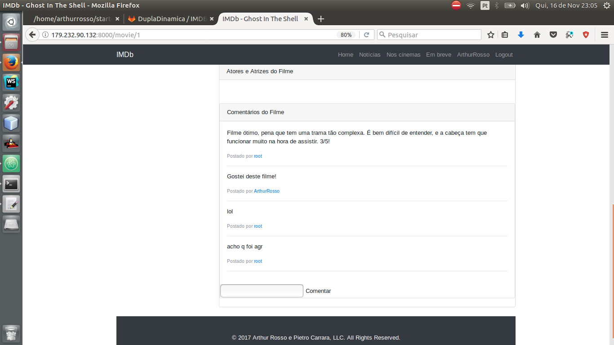

# IMDB
> Uma solução inovadora de busca de filmes.

[![NPM Version][npm-image]][npm-url]
[![Build Status][travis-image]][travis-url]
[![Downloads Stats][npm-downloads]][npm-url]

O IMDB (Banco de Dados de Filmes da Internet) é um site dedicado a armazenar informações sobre filmes (desde atores, diretores, ... até avaliações de usuários).

Nele é possível pesquisar vários filmes, pessoas e usuários.


 - - - - - - - - - - - - - - - - - - - - - - - - - - - - - - - - - - - - - - - - - - - - - - - -

## Instalação

Não precisa.

 - - - - - - - - - - - - - - - - - - - - - - - - - - - - - - - - - - - - - - - - - - - - - - - -

## Exemplo de uso

Essa é a página inicial!


 - - - - - - - - - - - - - - - - - - - - - - - - - - - - - - - - - - - - - - - - - - - - - - - -

Você pode fazer login


 - - - - - - - - - - - - - - - - - - - - - - - - - - - - - - - - - - - - - - - - - - - - - - - -

Ou você pode criar uma conta


 - - - - - - - - - - - - - - - - - - - - - - - - - - - - - - - - - - - - - - - - - - - - - - - -

Logado, agora você pode comentar ou avaliar, coisa que antes você só poderia ver.
À esquerda você pode ver as tags as quais o filme faz parte, e clicando nelas você pode ver uma lista de filmes que possuem as mesmas tags




 - - - - - - - - - - - - - - - - - - - - - - - - - - - - - - - - - - - - - - - - - - - - - - - -

## Configuração para Desenvolvimento

Como instalar todas as dependências para desenvolvimento e como rodar um test-suite automatizado.

```sh
git clone https://gitlab.com/rosso_pietro/IMDB.git
```

 - - - - - - - - - - - - - - - - - - - - - - - - - - - - - - - - - - - - - - - - - - - - - - - -
