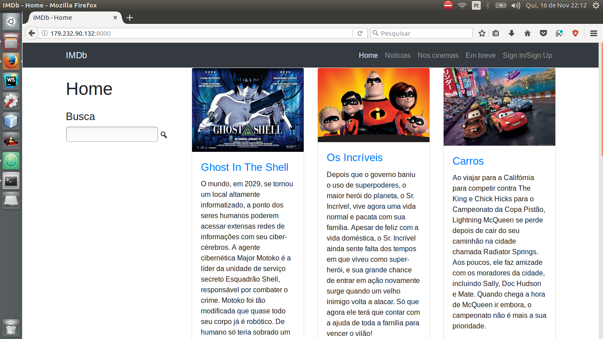
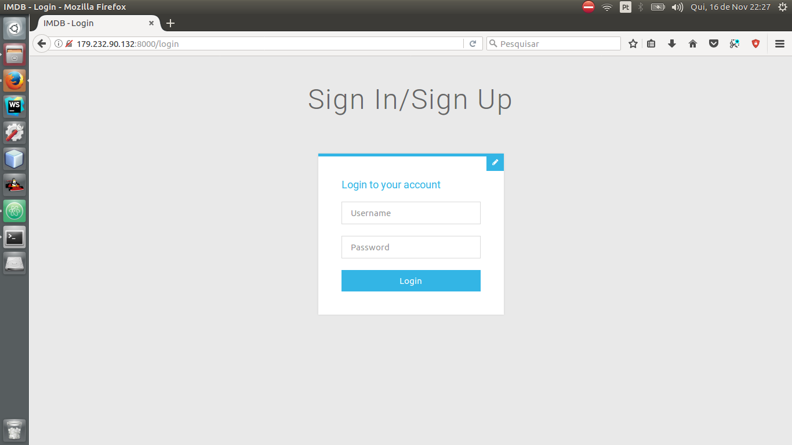
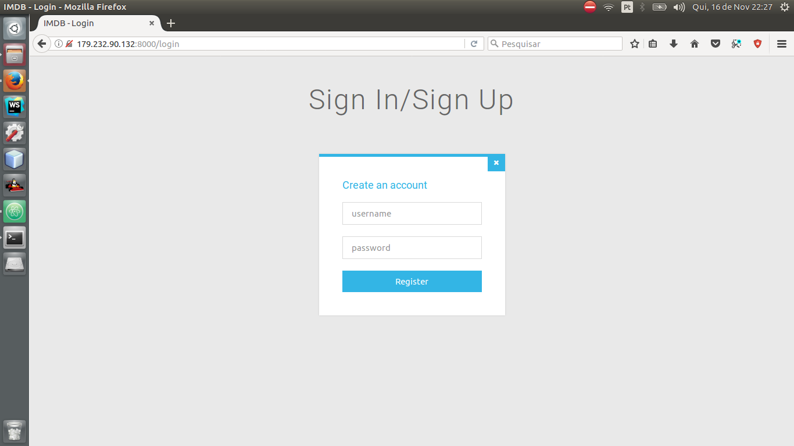

# IMDB
> Uma solução inovadora de busca de filmes.

[![NPM Version][npm-image]][npm-url]
[![Build Status][travis-image]][travis-url]
[![Downloads Stats][npm-downloads]][npm-url]

O IMDB (Banco de Dados de Filmes da Internet) é um site dedicado a armazenar informações sobre filmes (desde atores, diretores, ... até avaliações de usuários).

Nele é possível pesquisar vários filmes, pessoas e usuários.


 - - - - - - - - - - - - - - - - - - - - - - - - - - - - - - - - - - - - - - - - - - - - - - - -

## Instalação

Não precisa.

 - - - - - - - - - - - - - - - - - - - - - - - - - - - - - - - - - - - - - - - - - - - - - - - -

## Exemplo de uso

Essa é a página inicial!



 - - - - - - - - - - - - - - - - - - - - - - - - - - - - - - - - - - - - - - - - - - - - - - - -

Você pode fazer login



 - - - - - - - - - - - - - - - - - - - - - - - - - - - - - - - - - - - - - - - - - - - - - - - -

Ou você pode criar uma conta



 - - - - - - - - - - - - - - - - - - - - - - - - - - - - - - - - - - - - - - - - - - - - - - - -

Logado, agora você pode comentar ou avaliar, coisa que antes você só poderia ver
À esquerda você pode ver as tags as quais o filme faz parte, e clicando nelas você pode ver uma lista de filmes que possuem as mesmas tags


 - - - - - - - - - - - - - - - - - - - - - - - - - - - - - - - - - - - - - - - - - - - - - - - -

## Configuração para Desenvolvimento

Descreva como instalar todas as dependências para desenvolvimento e como rodar um test-suite automatizado de algum tipo. Se necessário, faça isso para múltiplas plataformas.

```sh
git clone
```

 - - - - - - - - - - - - - - - - - - - - - - - - - - - - - - - - - - - - - - - - - - - - - - - -

## Histórico de lançamentos

* 0.2.1
    * MUDANÇA: Atualização de docs (código do módulo permanece inalterado)
* 0.2.0
    * MUDANÇA: Remove `setDefaultXYZ()`
    * ADD: Adiciona `init()`
* 0.1.1
    * CONSERTADO: Crash quando chama `baz()` (Obrigado @NomeDoContribuidorGeneroso!)
* 0.1.0
    * O primeiro lançamento adequado
    * MUDANÇA: Renomeia `foo()` para `bar()`
* 0.0.1
    * Trabalho em andamento

## Meta

Seu Nome – [@SeuNome](https://twitter.com/...) – SeuEmail@exemplo.com

Distribuído sob a licença XYZ. Veja `LICENSE` para mais informações.

[https://github.com/yourname/github-link](https://github.com/othonalberto/)

[npm-image]: https://img.shields.io/npm/v/datadog-metrics.svg?style=flat-square
[npm-url]: https://npmjs.org/package/datadog-metrics
[npm-downloads]: https://img.shields.io/npm/dm/datadog-metrics.svg?style=flat-square
[travis-image]: https://img.shields.io/travis/dbader/node-datadog-metrics/master.svg?style=flat-square
[travis-url]: https://travis-ci.org/dbader/node-datadog-metrics
